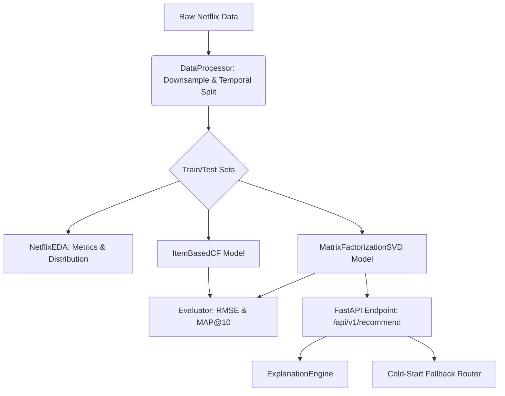

# Production Netflix Recommendation Engine

An end-to-end, object-oriented recommendation system built using the Netflix Prize dataset architecture, showcasing SDE and ML engineering standards.

## System Architecture Diagram


## Setup & Reproduction Guide

### 1. Environment Setup
Create a virtual environment and install dependencies:
```bash
python -m venv venv
source venv/bin/activate  # On Windows: venv\Scripts\activate
pip install -r requirements.txt
```

### 2. Running EDA & Pipeline Validation
The data pipeline and EDA engine can be executed by integrating the modules in a script or Jupyter notebook:
```python
from src.data_processing import DataProcessor
from src.eda import NetflixEDA

dp = DataProcessor()
df = dp.generate_simulated_data()
df_dense = dp.downsample_data(df)

eda = NetflixEDA()
stats = eda.run_full_analysis(df_dense)
print(stats)
```

### 3. Starting the Production Server
Run the FastAPI application locally:
```bash
python app.py
```
The API documentation will be available at `http://localhost:8000/docs`.

## Structural Tradeoffs: MF vs. CF

### Matrix Factorization (Funk SVD)
- **Strengths:** Excellent at minimizing **RMSE** globally. Captures latent user tastes and item attributes gracefully even with sparse data. Computationally fast at inference time.
- **Weaknesses:** Loses interpretability. Hard to explain exactly *why* a movie was recommended compared to item-based methods.
- **Metric Focus:** **RMSE** (Root Mean Squared Error) is optimized via Stochastic Gradient Descent.

### Item-Based Collaborative Filtering
- **Strengths:** High explainability and logical recommendations. Very effective at optimizing ranking metrics like **MAP@10**.
- **Weaknesses:** High computational cost at scale due to the $O(|I|^2)$ item-similarity matrix calculation. Struggles with complete cold-start items.
- **Metric Focus:** **MAP@10** (Mean Average Precision @ 10). It ranks structurally similar items effectively.
